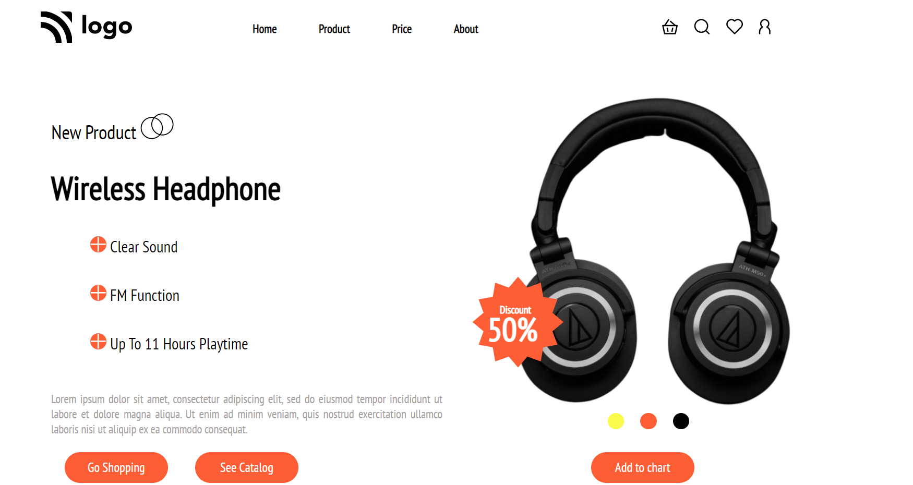

# Pratiksha Taank

***
## Technology Used
- HTML
- CSS
## Screenshot

### Mobile Responsive

## What I have learn in this project
- Learned flex box all conceps and tried to implement it in this project
- Learn about Media Query.
## Time Spent
I spent 4 hours to complete this project
## Live Link
Preview the project [Here](https://headphonehome.netlify.app/)
